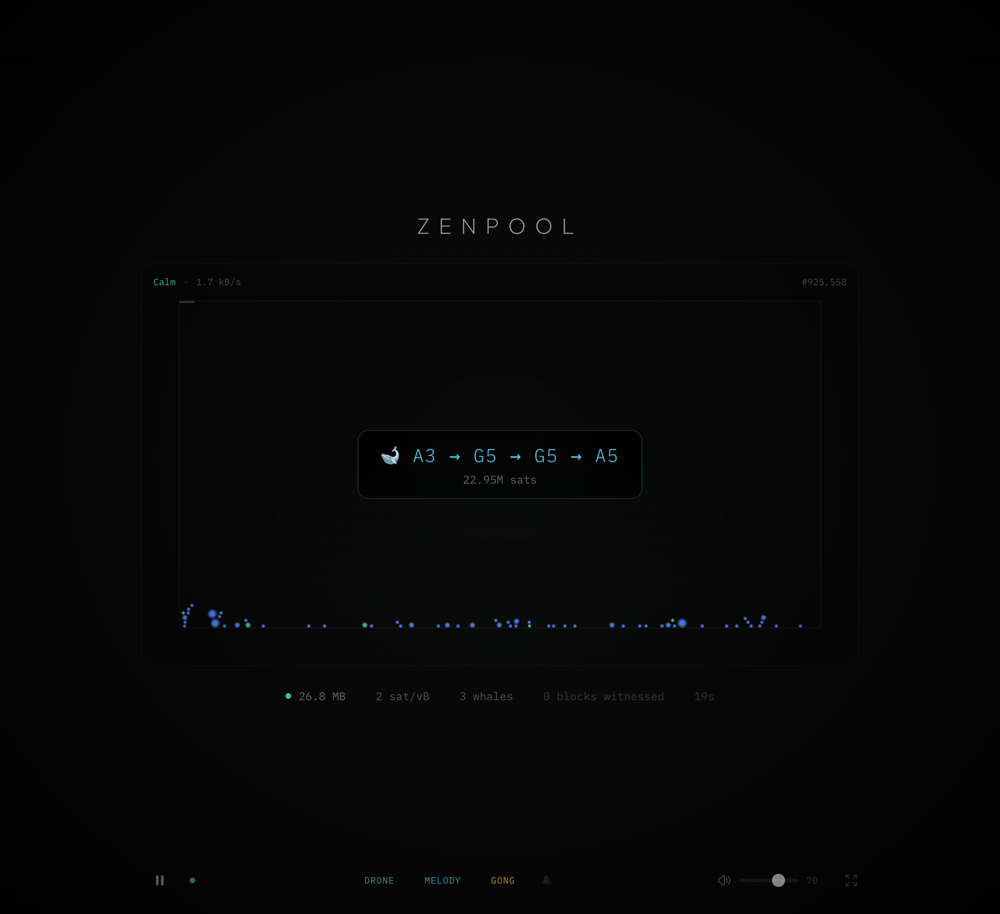

# 🧘 ZenPool

**Experience Bitcoin as ambient sound.**

ZenPool transforms the Bitcoin mempool into a meditative soundscape. Transactions become musical notes, network congestion modulates the ambient drone, and block confirmations trigger a resonant gong.



## ✨ Features

- **Ambient Drone** — A continuous pad that evolves with network stress (calm → tense)
- **Whale Melodies** — Large transactions (>0.01 BTC) generate unique 4-note arpeggios derived from their transaction hash
- **Block Gong** — When a block is mined, a deep resonant gong sounds
- **Particle Visualizer** — Transactions appear as glowing particles that accumulate like sand
- **Real-time Data** — Connected to mempool.space WebSocket API

## 🚀 Quick Start

```bash
# Install dependencies
npm install

# Start the development server
npm run dev
```

Then open [http://localhost:5173](http://localhost:5173) in your browser.

> **Note:** Click "Begin" to start the audio (browsers require user interaction to enable sound).

## 🎛️ Controls

| Control | Description |
|---------|-------------|
| **Play/Pause** | Start or stop the soundscape |
| **Drone** | Toggle the ambient background pad |
| **Melody** | Toggle whale transaction melodies |
| **Gong** | Toggle block confirmation sound |
| **🔔** | Test the gong sound |
| **Volume** | Adjust master volume |
| **⛶** | Enter fullscreen mode |

## 🎵 How It Works

### Sound Mapping

| Bitcoin Event | Audio Response |
|---------------|----------------|
| Network calm | Ethereal, spacious drone |
| Network busy | Tense, gritty drone |
| Whale transaction | Unique 4-note arpeggio |
| Block mined | Deep gong + filter sweep |

### Visual Mapping

| Data | Visual |
|------|--------|
| Transaction | Glowing particle |
| Transaction size | Particle size |
| Fee rate | Particle color (blue→red) |
| Block confirmation | Particles crystallize & clear |

## 🛠️ Tech Stack

- **React + TypeScript** — UI framework
- **Vite** — Build tool
- **Tone.js** — Web audio synthesis
- **Tailwind CSS** — Styling
- **mempool.space API** — Real-time Bitcoin data

## 📁 Project Structure

```
src/
├── audio/
│   ├── AudioEngine.ts    # Main audio controller
│   ├── DroneEngine.ts    # Ambient pad synthesis
│   ├── MelodyEngine.ts   # Hash-to-melody generation
│   └── GongEngine.ts     # Block confirmation sound
├── components/
│   └── ParticleVisualizer.tsx  # Canvas particle system
├── hooks/
│   ├── useMempoolSocket.ts     # WebSocket connection
│   └── useAudioEngine.ts       # Audio state management
└── App.tsx               # Main application
```

## 🎨 Philosophy

Unlike typical crypto apps that induce urgency with price charts and alerts, ZenPool uses the same data to induce **presence**. 

The Bitcoin network becomes a digital wind chime — transactions flow like wind, and the gong rings when the network decides, not on a fixed timer. This teaches patience and surrender better than any meditation app with a countdown.

## 📄 License

MIT

---

*Listen to the Bitcoin network. Transactions become sound. Blocks become silence.*
